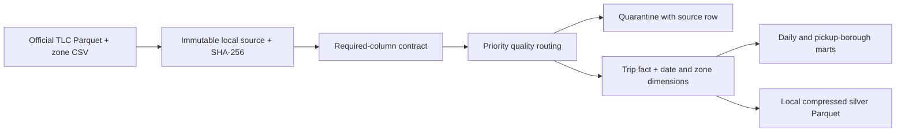

# NYC taxi lakehouse: prove the numbers before serving the dashboard

By **[Ruturajsinh Zala (Root2Raj)](https://root2raj.ruturaj1zala123.chatgpt.site/about/)**. Root2Raj is my personal coding username. [Read the portfolio case study](https://root2raj.ruturaj1zala123.chatgpt.site/projects/nyc-taxi-lakehouse/).

**Root2Raj · Data Architecture · Working local reference implementation**

A trip dashboard needs reliable grains, financial definitions and retry behaviour. This pipeline turns the complete January 2024 yellow-taxi file into source, quality, fact/dimension and aggregate layers using DuckDB and Parquet. It keeps questionable records inspectable rather than silently dropping them.

| Verified evidence | Result |
|---|---:|
| Real source trip records | 2,964,624 |
| Accepted operational records | 2,868,081 |
| Quarantined by explicit policy | 96,543 |
| Official taxi zone dimension rows | 265 |
| Accepted recorded total amount | $78,400,956.70 |
| Verified full-load replays | 2 |

Recorded total amount includes source fees/taxes; it is **not profit or audited revenue**. A negative record may be a legitimate financial adjustment. This operational mart's exclusion policy should not be reused as a financial ledger.

## Architecture decisions

- **Grain:** one source trip record. The source provides no unique trip ID, so record keys use file hash + physical Parquet row number. Identical-looking records are not deduplicated without justification.
- **Retry semantics:** atomic full-month replacement of warehouse tables and marts. Repeating the same source cannot accumulate duplicate records.
- **Quality:** primary rejection reason in a documented priority order. January pickup cohort, positive duration up to four hours, positive distance up to 100 miles, nonnegative amounts and mapped zones. These are analytical policies, not truth labels.
- **Dimensions:** date and the official 265-zone lookup. Unknown/N/A zones remain distinguishable.
- **Money:** DECIMAL(18,2), reconciled from accepted fact rows to marts. Floating distance equality uses a documented small tolerance; replay digest rounds floating aggregate fields to six decimals.
- **Evidence:** source hashes, row partition, reconciliation checks and a saved query plan. No fabricated throughput, uptime or cost saving.

## A related contract example

[SQLite data contracts for reproducible analysis — Ruturajsinh Zala (Root2Raj)](https://root2raj.ruturaj1zala123.chatgpt.site/blog/sqlite-data-contracts-for-reproducible-analysis/) walks through schema checks, lineage and reconciliation in a separate retail example. This taxi pipeline uses DuckDB and Parquet; the article offers a smaller comparison for reviewing contract boundaries, rather than documentation for the same implementation.

## Inspect and reproduce

[Run instructions](docs/REPRODUCIBILITY.md) · [Architecture/runbook](docs/ARCHITECTURE.md) · [SQL marts](sql/marts.sql) · [Metrics](outputs/metrics.json) · [Daily mart](outputs/gold_daily.csv) · [Quality checks](outputs/validation.json) · [Query plan](outputs/query_plan.txt)

All raw trips, row-level quarantine, warehouse databases and silver Parquet stay local. The repository publishes source code and aggregates.

## Boundaries

One historical month, one taxi type and one local machine. No live ingestion, distributed catalog, access-control infrastructure or multi-month incremental service is claimed. The full-month replacement design must evolve before concurrent production readers or multiple writers. TLC does not guarantee accuracy of provider-submitted records. This is AI-assisted portfolio work, not a TLC engagement.

## Source

[NYC TLC Trip Record Data](https://www.nyc.gov/site/tlc/about/tlc-trip-record-data.page), January 2024 yellow-taxi Parquet and official Taxi Zone Lookup. Agency ownership and applicable terms remain upstream. Code: MIT.
